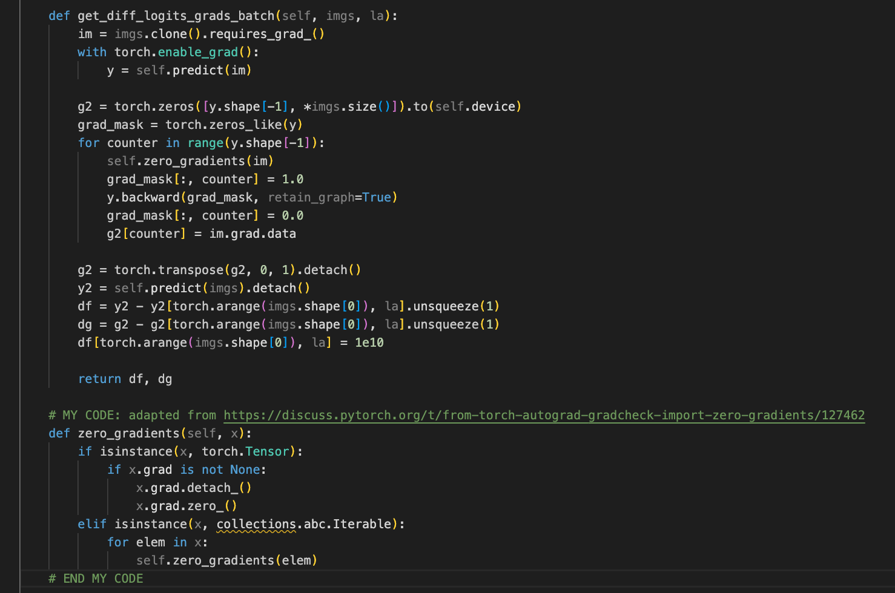

# Finding Critical Sets for Training Pruned Deep Neural Networks

## Experiment Instructions

To run the experiments, complete the following steps:
1. Install the dependencies in `requirements.txt` or activate the included virtual environment using ``source venv/bin/activate``.
2. Make this addition to the advertorch library (in file ``advertorch/attacks/fast_adaptive_boundary.py``) to fix an error:

3. Utilize the CLI defined in `main_PrAC_imp.py`.

## Example Usage

To run the PrAC-LTH algorithm on CIFAR-10 with ResNet-20, use the following command:
``python -u main_PrAC_imp.py --data data/cifar10 --dataset cifar10 --arch res20s --split_file npy_files/cifar10-train-val.npy --batch_size 128 --lr 0.1 --pruning_times 16 --eb_eps 0.08 --prune_type rewind_lt --rewind_epoch 2 --threshold 0 --save_dir cifar10_res20s_prac_imp``

To run a modified version of Algorithm 1 with only hard to memorize samples included in the critical set, use the following command:
``python -u main_PrAC_imp.py --core_set_method hard_to_memorize --data data/cifar10 --dataset cifar10 --arch res20s --split_file npy_files/cifar10-train-val.npy --batch_size 128 --lr 0.1 --pruning_times 16 --eb_eps 0.08 --prune_type rewind_lt --rewind_epoch 2 --threshold 0 --save_dir cifar10_hard_to_memorize``

## Distribution of Code
This code has been forked from the researcher's implementation [here](https://github.com/VITA-Group/PrAC-LTH). The files that have been modified are:
- `main_PrAC_imp.py`
	- This file was modified to accomodate the MNIST dataset as well as to add a command line argument to run modified 
	versions of Algorithm 1. Furthermore, significant log statements were added to track the progress of the algorithm, 
	the critical set, and the time of execution.
- `utils/setup.py`
	- This file was edited to add the MNIST dataset. Specifically, the data was normalized before being passed into a dataset 
	loader from Pytorch. Additionally, an argument was added to the model to allow for the input channels to change, as 
	the researchers used data that used three input channels, while MNIST only has one input channel.
- `dataset.py`
	- This file was edited to add the MNIST dataset. The data was first transformed using Pytorch transforms. Then, it was 
	split into train, test, and validation sets and passed through a dataset loader from Pytorch. This process was added for 
	the MNIST dataset.
- `utils/pruner.py`
	- A few comments were added to this file to better understand it.
- `.gitignore`
	- This file was edited to ignore the virtual environment that was created and the large tar files used in training.

The files that have been added are:
- `utils/save_files.py`
- `utils/runner.py`
- `utils/compare-bars.py`
- `utils/compare_acc.py`
- `utils/requirements.txt`
- `experiments/mnist_test.py`
- `experiments/testing_bars.py`
- `experiments/figures/mnist.png`
- ``npy_files/mnist-train-val.npy``

The remaining files are the same as the original implementation [here](https://github.com/VITA-Group/PrAC-LTH).

## Description of Datasets

The datasets used for these experiments are MNIST, CIFAR-10, and CIFAR-100.

### MNIST

The MNIST dataset is a dataset of black and white handwritten digits. It contains 60,000 training images and 10,000 testing images. Each image is 28x28 pixels. The dataset is split into 10 classes, one for each digit. It is available via Pytorch.

### CIFAR-10

The CIFAR-10 dataset is a dataset of 60,000 32x32 color images in 10 classes, with 6,000 images per class. There are 50,000 training images and 10,000 test images. The dataset is split into 10 classes, each describing common, everyday objects. It is available via Pytorch.

### CIFAR-100

The CIFAR-100 dataset is a dataset of 60,000 32x32 color images in 100 classes, with 600 images per class. There are 50,000 training images and 10,000 test images. The dataset is split into 100 classes and 20 superclasses. Each image comes with a "fine" label, describing its class, and a "coarse" label, describing its superclass. It is available via Pytorch.